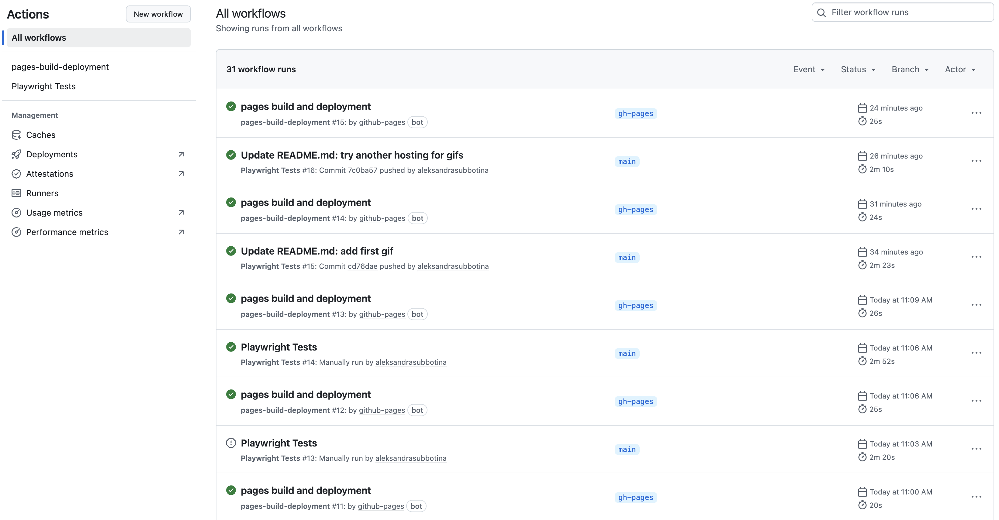

# Welcome to Playwright UI Tests

🌸&nbsp; The main (and only) goal of this project is to showcase my approach to writing reliable, readable, and maintainable automated tests. I made it small, but practical and reviewer-friendly.

Thank you for your attention! &nbsp;🌸
<br>
<br>

---

## Project overview 🌼

This repository contains end-to-end UI tests for demo e-commerce platform [saucedemo.com](https://www.saucedemo.com) built with:

_Playwright
&nbsp;🌱&nbsp; TypeScript
&nbsp;🌱&nbsp; Allure
&nbsp;🌱&nbsp; GitHub Actions
&nbsp;🌱&nbsp; Docker_

<br>

---

## Table of Contents

- [🪻 What's inside?](#whats-inside-)
- [🌿 How to launch the project](#how-to-launch-the-project-)
  - [1. Prerequisites](#1-prerequisites)
  - [2. Setup](#2-setup)
  - [3. Run tests](#3-run-tests)
  - [4. How to explore the Allure report](#4-how-to-explore-the-allure-report)
- [🌲 Challenges and Solutions](#challenges-and-solutions-)
- [🍁 The End](#the-end-)

<br>

---

## What's inside? 🪻

- **automated Login, Products, Cart, Checkout flows** for e-commerce platform (bonus: a test that intentionally fails to showcase reporting)
- **`.env`** file and **GitHub Secrets** for credentials (safe version of `.env` is included for reviewers convenience)
- saved and **reused** login &nbsp;🍪&nbsp; **cookies** (storageState) for faster test setup
- ready-to-use scripts to **run** project **locally**&nbsp;🏡&nbsp;, in **CI**&nbsp;🔄&nbsp;, or inside **Docker**&nbsp;🚢
- **Allure reports** are generated automatically
- scripts for easy **setup** and **cleanup**

<br>

---

## How to launch the project 🌿

### 1. Prerequisites

To get the project running, you’ll need a couple of things installed:

&nbsp;&nbsp;🪴&nbsp; **to launch the tests:**

- [Node.js](https://nodejs.org/) 20 or higher
- [npm](https://www.npmjs.com/) 9 or higher

&nbsp;&nbsp;🪴&nbsp; **if you want to view the reports locally:**

- [Java](https://www.java.com/) (needed for Allure)

&nbsp;&nbsp;🪴&nbsp; **if you prefer running tests in Docker:**

- [Docker](https://www.docker.com/)

---

### 2. Setup

Install dependencies:

```bash
npm ci
```

💡&nbsp; No need to create an .env file since it is already included in the repository for your convenience
(public demo credentials from [saucedemo.com](https://www.saucedemo.com/) are safe to commit here).

In real projects you never commit `.env`. Instead, you add it to `.gitignore` and keep your secrets safe
in something like GitHub Secrets or another secure storage.

---

### 3. Run tests

You can run project locally&nbsp;🏡&nbsp;, inside Docker&nbsp;🚢, or in CI&nbsp;🔄&nbsp;.
The project also contains a failing test, that can be run to showcase reporting.

<br>

&nbsp; 🏡&nbsp; **Run all passing tests and view report locally**

```bash
npm run test:local
```

- prepares folders, cleans artifacts
- runs all passing tests
- generates and opens Allure report


---

&nbsp; 🚢&nbsp; **Run tests inside Docker**

```bash
npm run docker:test:report
```

- builds the Docker image
- runs all tests inside a container
- generates and opens Allure report locally


---

&nbsp; 🔄&nbsp; **Run tests in CI**

```bash
npm run test:ci
```

The script is used in the GitHub Actions workflow (.yml file) that:

- automatically launches tests on every push or pull request to main
- runs the full test suite (excluding the demo failing test)
- generates an Allure report after the run
- publishes it to GitHub Pages for easy sharing



---

&nbsp; ❌&nbsp; **Run only the intentionally failing test and view report locally**

```bash
npm run test:fail:full
```

- prepares folders, cleans artifacts
- runs only the failing test (`@demo-fail`)
- generates and opens Allure report


---

### 4. How to explore the Allure report:

The report opens automatically after the test run in your default browser if you use any of the above scripts.

&nbsp; 🐶&nbsp; Open Overview for pass/fail summary

&nbsp; 🐶&nbsp; Use Suites to find scenarios

&nbsp; 🐶&nbsp; Click a test to see steps (and screenshots, video, and trace if a test has failed)


<br>

I wrapped all Page Object methods in Allure steps — so the tests stay clean, steps are reusable, and the report is easy to read.

<br>

---

## Challenges and Solutions 🌲

Here are some of the project challenges that I encountered and how I solved them:

1. Most tests required a logged-in state → created a setup using storageState to reuse session cookies, saving time and reducing flakiness.
2. Making methods easy to use while keeping them reusable → added default behaviors (e.g., remove first item if no name is provided) and JSDoc for clarity.
3. Needed test data for address forms → integrated the Faker library to generate random addresses, helping to delay the Pesticide Paradox.
4. Test methods inside Page Objects weren’t reflected clearly in reports → wrapped every Page Object method in Allure steps, keeping test files readable while generating reusable and detailed report steps.
5. Handling sensitive data in .env files while keeping reviewer convenience → added .env.example to show best practices and kept a .env with demo credentials safe to share.
6. Ensuring scripts work on all platforms → added cross-platform commands (e.g. rimraf instead of rm -rf).
7. Docker builds were heavy and slow → switched to a lightweight Playwright image with Chromium only (mcr.microsoft.com/playwright:v1.54.2-jammy).
8. Running tests in Docker and mapping volumes for Allure results was tricky → defined volume mounts for allure-results, allure-report, and test-results to share data between host and container.
9. Cleaning allure-results or allure-report failed on mounted volumes → used rimraf ./folder/\* instead of deleting the folder and ensured folders exist before Docker runs.
10. Intentionally failing test (@demo-fail) broke CI if included in regular runs → excluded it from normal test runs (test:full) and created a dedicated script (test:fail:full) to run and view it separately.

<br>

---

## The End 🍁

This project is a demo, but the practices shown here (Page Object Model, Allure steps, CI integration, Dockerization) are exactly what I use in a real test automation setup.

Hopefully, it gives you a clear picture of how I approach test automation design.

**Thank you for your time!**


<br>

<br>
